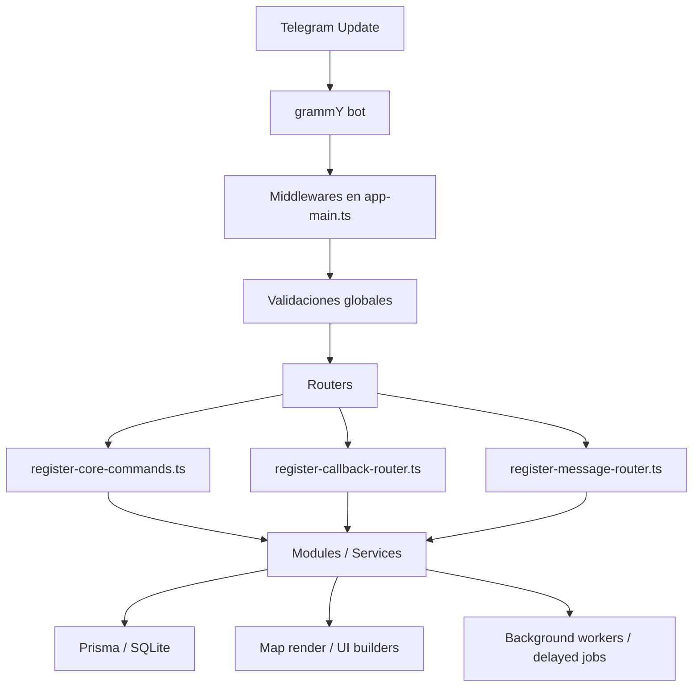
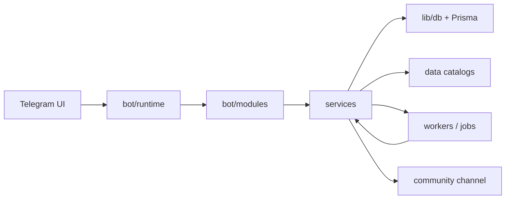

# World of Nova - Architecture Master Map

## 1. Estado General

World of Nova es un backend de MMORPG para Telegram construido sobre:

- Node.js + TypeScript
- grammY para transporte Telegram
- Prisma Client
- SQLite como base actual
- Redis instalado como dependencia, pero no es hoy el centro del runtime

El proyecto ya no es un bot lineal. Funciona como un backend de juego con:

- mundo compartido
- generacion procedural
- inventario y equipo
- economia comunitaria
- sistema de builds
- PvE tactico
- muerte, cuerpo y plano astral
- canal de patch notes

## 2. Entry Points

### Bot principal

- `src/index.ts`
  - solo importa `src/app-main.ts`

- `src/app-main.ts`
  - crea el bot
  - instala transformador de custom emojis
  - registra middleware
  - inicializa sistemas
  - arranca workers de fondo
  - publica patch notes comunitarios
  - registra comandos, callbacks y router de mensajes

### Worker secundario

- `src/worker.ts`
  - conecta DB
  - inicializa bot sin polling
  - procesa jobs y recoveries de fondo

## 3. Flujo Runtime del Bot

## 4. Estructura de Carpetas

### `src/bot`

Contiene la capa de interfaz del bot.

- `modules/`
  - UI y flujos por dominio
  - ejemplo: market, forge, bank, pve, racial, build, place
- `runtime/`
  - registro de comandos
  - router de callbacks
  - router conversacional de mensajes

### `src/services`

Es la capa de dominio real del juego.

Aquí vive la mayor parte de la logica:

- mapa
- clima
- ciclos dia/noche
- criaturas
- combate
- inventario
- banco
- mercado
- mercader misterioso
- builds
- muerte y cuerpo
- cuevas

### `src/data`

Catálogos y definiciones estáticas.

- emojis
- diccionario del juego
- skill trees
- balance racial
- place UI
- patch notes de comunidad

### `src/lib`

Infraestructura y utilidades compartidas.

- DB
- i18n
- cola por jugador
- runtime config
- métricas
- custom emojis
- conversación

### `docs`

Documentación funcional y de producto.

Ya existe bastante documentación útil, pero faltaba un mapa maestro de arquitectura.

## 5. Routers y Responsabilidades

### `register-core-commands.ts`

Responsable de comandos slash.

Ejemplos:

- `/start`
- `/profile`
- `/map`
- `/inspect`
- `/interact`
- `/place`
- `/merchant`
- `/racial`
- `/bs`
- `/combat`
- `/sos`

### `register-callback-router.ts`

Responsable de botones inline.

Coordina:

- mapa
- bag
- inspect
- place
- market
- forge
- merchant
- PvE
- build
- racial
- ghost state

Es el gran puente entre UI inline y dominio.

### `register-message-router.ts`

Responsable de estados conversacionales.

Ejemplos:

- viaje por coordenadas
- cantidad al recolectar
- cantidad al usar o soltar
- cantidades de mercado
- respuestas contextuales a módulos

## 6. Dominios Principales

### Mundo y navegación

Archivos clave:

- `src/services/map.ts`
- `src/services/map-data.ts`
- `src/services/map-render.ts`
- `src/services/map-move.ts`
- `src/services/map-utils.ts`
- `src/services/world-map.ts`

Responsabilidades:

- obtener o generar tiles
- renderizar mapa
- mover jugador
- descubrir tiles
- unificar mapa canónico del mundo

Observación:

`map.ts` ya funciona como facade y eso es bueno. El dominio del mapa está mejor separado que antes.

### Biomas, zonas, clima y horario

Archivos clave:

- `src/services/world-biomes.ts`
- `src/services/world-zones.ts`
- `src/services/climate.ts`
- `src/services/day-cycle.ts`
- `src/data/day-cycle.ts`

Responsabilidades:

- anillos de dificultad por distancia radial
- selección procedural de bioma
- climas por zona
- modificadores ambientales
- ciclo global de amanecer/día/atardecer/noche

### Inventario, herramientas y equipo

Archivos clave:

- `src/services/bags.ts`
- `src/services/tools.ts`
- `src/services/bags-utils.ts`
- `src/services/bags-equipment-utils.ts`

Responsabilidades:

- bags activas y guardadas
- pockets por defecto
- slots y peso
- herramientas y durabilidad
- equipo activo
- consumo y drop de items
- loot al suelo

### Lugares, edificios y recovery

Archivos clave:

- `src/services/place-custom.ts`
- `src/services/place-recovery.ts`
- `src/services/place-ui-render.ts`
- `src/services/place-bootstrap.ts`
- `src/services/dynamic-places.ts`

Responsabilidades:

- hoteles, templo, forja, banco, exchange, entrenamiento
- servicios temporales y gratuitos
- bind de alma
- lugares dinámicos y POIs

### Economía

Archivos clave:

- `src/services/market-exchange.ts`
- `src/services/market-exchange-hub.ts`
- `src/services/market-exchange-inventory.ts`
- `src/services/market-exchange-read.ts`
- `src/services/crown-bank.ts`
- `src/services/mystery-merchant.ts`

Responsabilidades:

- marketplace de órdenes
- exchange oro/plata
- holdings de mochila/bóveda/mercado
- bóveda del banco
- mercader NPC dinámico

### Builds y progresión

Archivos clave:

- `src/services/build-skills.ts`
- `src/services/racial-talents.ts`
- `src/services/progression.ts`
- `src/services/gameplay-effects.ts`
- `src/data/skill-trees.ts`
- `src/data/racial-talents.ts`
- `src/data/racial-balance.ts`

Responsabilidades:

- puntos por nivel
- árboles de build
- talentos raciales
- loadouts
- efectos activos y pasivos
- telemetría de builds

### Criaturas y PvE

Archivos clave:

- `src/services/creatures.ts`
- `src/services/pve-combat.ts`
- `src/services/creature-defeat.ts`
- `src/bot/modules/pve-module.ts`
- `src/bot/modules/pve-ui.ts`

Responsabilidades:

- generación de criaturas
- snapshots de enemigos
- encuentros PvE persistentes
- combate por turnos
- intenciones enemigas
- drops, XP, monedas

### Muerte, cuerpo y plano astral

Archivos clave:

- `src/services/death-system.ts`

Responsabilidades:

- crear cadáver persistente
- estado ghost
- cementerio cercano
- recuperación del cuerpo
- render astral del mapa

### Cuevas

Archivos clave:

- `src/services/cave-system.ts`

Responsabilidades:

- instancia de cueva
- estado de jugador dentro de la cueva
- exploración interna
- salida/entrada a cave layer

### Comunidad y progreso

Archivos clave:

- `src/services/community-updates.ts`
- `src/data/community-patches.ts`

Responsabilidades:

- render de patch notes
- publicar/editar posts en canal
- evitar duplicados por hash

## 7. Persistencia

### Base declarada en Prisma

El esquema principal vive en `prisma/schema.prisma`.

Hay `34` modelos Prisma declarados.

Dominios principales ya modelados ahí:

- jugadores
- tiles
- biomas
- resources
- places
- bags
- tools
- skills base
- títulos
- razas y clases
- clima

### Base creada en runtime con SQL manual

Además, varios sistemas crean sus tablas con `CREATE TABLE IF NOT EXISTS` dentro del código.

Ejemplos:

- `PlayerBuildSkill`
- `PlayerBuildLoadout`
- `PlayerBuildEffect`
- `PlayerBuildCooldown`
- `BuildTelemetryEvent`
- `PlayerRacialTalent`
- `PlayerRacialLoadout`
- `PlayerPveEncounter`
- `PlayerSoulAnchor`
- `PlayerCorpse`
- `PlayerDeathState`
- `CaveInstance`
- `PlayerCaveState`
- `WorldCreatureSpawn`
- `CommunityAnnouncement`

## 8. Implicación de este esquema híbrido

Este es el punto técnico más delicado del proyecto.

### Ventajas

- permite iterar rápido
- evita bloquear features por migraciones formales
- hace posible prototipar gameplay sin frenar desarrollo

### Riesgos

- el source of truth del esquema está dividido
- Prisma no conoce todo el modelo real
- una migración a Postgres será más compleja si no se normaliza antes
- más difícil auditar integridad y relaciones
- mayor riesgo de drift entre runtime y schema.prisma

## 9. Concurrencia y ejecución

### Cola por jugador

`src/lib/player-action-queue.ts`

Protege operaciones del mismo jugador con:

- cola por key
- límite total
- límite por jugador
- métricas de wait y run

Esto es una buena base MMO para evitar dobles acciones y carreras locales.

### Workers / timers

Sistemas observados:

- jobs diferidos
- clima
- mercader misterioso
- recovery
- métricas

Esto ya convierte al proyecto en backend con procesamiento asíncrono real, no solo request/response de bot.

## 10. Tamaño actual del núcleo

Archivo principal:

- `src/app-main.ts` -> `2616` líneas

Servicios más grandes:

- `src/services/pve-combat.ts` -> `1982`
- `src/services/bags.ts` -> `1590`
- `src/services/build-skills.ts` -> `1111`
- `src/services/mystery-merchant.ts` -> `1106`
- `src/services/death-system.ts` -> `1044`
- `src/services/inspect.ts` -> `1016`

## 11. Lectura honesta del estado actual

### Lo que ya está bien

- Hay separación real por dominios.
- El mapa ya usa facades y submódulos.
- La UI bot ya no está toda metida en un solo archivo.
- Existe cola por jugador.
- Hay telemetría y workers.
- El juego ya tiene muchos loops persistentes reales.

### Lo que aún no está “MMO limpio”

- `app-main.ts` sigue siendo demasiado grande.
- varios servicios concentran demasiada lógica, estado, SQL y UI al mismo tiempo.
- persiste mezcla entre dominio, rendering y orquestación en archivos grandes.
- el esquema híbrido Prisma + SQL runtime es la deuda arquitectónica principal.
- siguen existiendo señales de encoding roto en algunos archivos y strings históricas.

## 12. Mapa de dependencias conceptuales

## 13. Prioridades de refactor recomendadas

### Prioridad 1

Reducir el peso de:

- `app-main.ts`
- `pve-combat.ts`
- `bags.ts`
- `build-skills.ts`

### Prioridad 2

Separar en cada dominio:

- reglas puras
- persistencia
- render/UI
- orquestación

### Prioridad 3

Definir una estrategia para converger el esquema híbrido:

- o migrar runtime tables a Prisma
- o documentar explícitamente qué tablas quedan fuera y por qué

### Prioridad 4

Normalizar encoding y textos históricos para evitar mojibake.

## 14. Conclusión

World of Nova ya no es un experimento. Es un backend de juego vivo con varios sistemas serios conectados.

Arquitectónicamente, está en una etapa intermedia:

- más modular y profesional que antes
- suficientemente complejo como para sostener features grandes
- pero todavía con deuda real en núcleo, persistencia y tamaño de archivos

La mejor forma de seguir creciendo sin romperse es:

1. partir los servicios gigantes
2. reducir responsabilidades cruzadas
3. unificar la estrategia de esquema de base de datos
4. mantener este mapa como referencia para cada refactor nuevo
